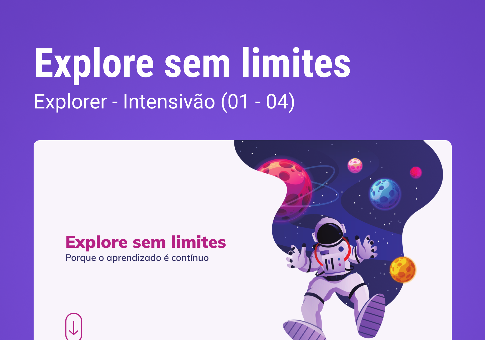

  

## 💻 Projeto
Esse projeto foi desenvolvido como desafio das aulas dos Stages 01 a 04 no Explorer da [Rocketseat](https://rocketseat.com.br).

### O que foi colocado em prática:
- Regra <i>mobile first</i> 
- Animações, transições e transformações
- Unidades de medidas flexíveis (rem)
- Variáveis no CSS

## 🚀 Tecnologias

Esse projeto foi desenvolvido com as seguintes tecnologias:

- HTML
- CSS

## 🔖 Layout

Você pode ver o layout do projeto
[aqui](https://www.figma.com/file/563kgHMxsEy17nCdTJI6JC/Explore-sem-limites/duplicate).
